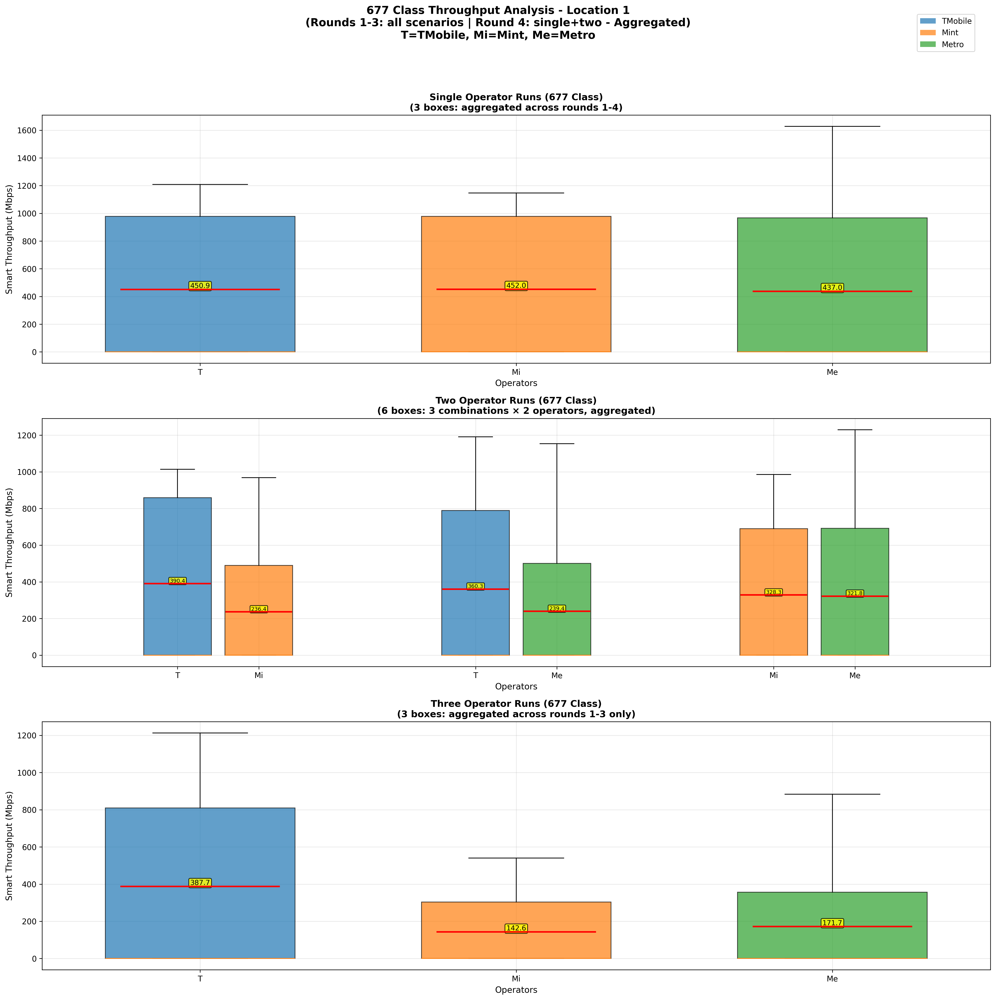
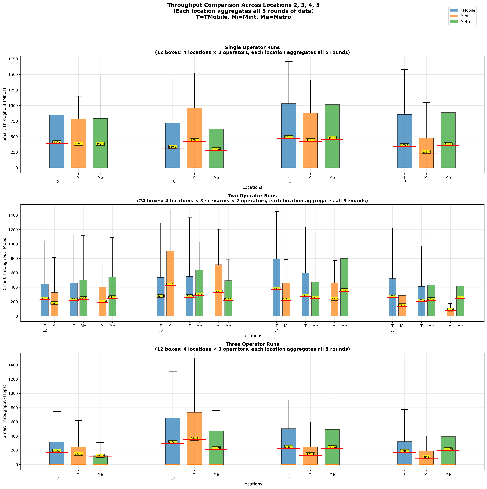

# T-Mobile (M) & Mint (V1) & Metro (V2) at Boston
## Location 1 - Malden Center
TMobile PCI: (688, 688, 634, 511), Qci: 6 -> 9   
Mint PCI: (688, 688, 634, 511), Qci: 7 -> 9   
Metro: (688, 688, 634, 511), Qci: 7 -> 9   
### T-Mobile + Mint Round 5 - T-Mobile throughput dropped
PCI, NR-ARFCN, RSRP, RSRQ, SINR, Bandwidth almostly stay same  
RB utilization ratio, slot utilization ratio, Transport Block Size dropped  
Mint throughput no significant increase  
**Qci 6 -> 9 (Mint is also 9)**  
--> More UEs of T-Mobile connected to gNB (May subject to some UE with Qci = 7)  

### T-Mobile + Metro Round 2 - T-Mobile throught slightly dropped
1. PCell throughput increased: 203 -> 288
   - NR-ARFCN 520110 -> 502110; Bandwidth 100 -> 90
   - RB utilization ratio increased: 23% -> 35%  (more active slot)
2. SCell[1], SCell[2], SCell[3] were inactive
   - RSRP are bad, no throughput (no RB utilization ratio, no slot utilization ratio)

### T-Mobile + Metro Round 5 - T-Mobile dropped, Metro increased
TMobile PRB, RB utilization, slot utilization dropped   
Metro PRB, RB utilization, slot utilization increased  
**T-Mobile Qci 6 -> 9, Metro Qci stay 7**

### Mint + Metro - Round 5 - Mint dropped, Metro increased
Mint PRB, RB utilization, slot utilization dropped  
Metro PRB, RB utilization, slot utilization increased  
**Mint Qci 7 -> 9, Metro Qci stay 7**

### M + V1 + V2, Round 3 Mint dropped
PCell perform regularly  
SCell[1], SCell[2], SCell[3] were inactive, RSRP very bad

### M + V1 + v2, Round 4 TMobile dropped
**TMobile Qci 6 -> 9, Mint & Metro stay 7**
TMobile PRB, RB utilization, slot utilization dropped   

Zoom in the red zone:

### M + V1 + V2, Round 5, 3 operators perform closely
**TMobile & Mint Qci 9, Metro half 7 half 9**

TMobile & Mint PRB, RB utilization, slot utilization dropped   
Metro PRB, RB utilization, slot utilization increased in the first half and decreased in the second half

## Location 2 - Downtown Crossing
### M + V1, Round 2 & Round 3, Mint dropped
- Different PCI: Round 1 both 838(PCell & SCell[1]), Round 2 & 3 TMobile 838 Mint 863, Round 4 TMobile 838 -> 863 (handover halfway), Round 5 both 863
- Mint Avg CQI, RI dropped -> Avg Layer Number, MCS dropped (compared to round 5)

### M + V2, Round 5, TMobile dropped, Metro increased
- Different PCI: Round 1,2,3 both 838, Round 4 both 863, Round 5 TMobile 863 Metro 838
- TMobile PRB, slot utilization increased, Avg Layer Number, MCS dropped -> through slightly dropped (compared to round 4, different PCI with other rounds)  

### V1 + V2, Round 1 & Round 4, Mint increased, Metro dropped
- Round 1 & 4 Mint and Metro were both on Cell 838 (PCell & SCell[1])  
- Round 2, 3, 5 Mint on 863 while Metro on 838 (PCell & SCell[1])
- Round 1 diff ARFCN

### M + V1 + V2
- Round 1, all on 838, diff ARFCN: TMobile & Metro = 502110, Mint = 520110
- Round 2, (838, 863, 838), ARFCN all 502110, Metro's all SCells were dead (RSRP,RSRQ,SINR were bad)
- Round 3, (838, 863, 838->863), ARFCN all 502110
- Round 4, (863, 838, 863), ARFCN all 502110, Metro's all SCells were dead (RSRP,RSRQ,SINR were bad)
- Round 5, (863, 863, 838), ARFCN all 502110, Mint's SCells struggled bud not dead (RSRP,RSRQ,SINR were bad)

## Location 3 - Ariport
**Mint can use 80% ~ 100% LTE resources**
### M + V1, Round 2, TMobile increased
- TMobile PCI 381(PCell, 90MHz) + 750(SCell[2], 15MHz), Mint PCI 701(50MHz) + 87(LTE, 15MHz) + 475(LTE, 20MHz)
- PRB, active slot increased

### M + V2, Round 3, TMobile dropped
- TMobile PCI 381 + 750, Metro PCI 958(PCell, 15MHz) + 701(SCell, 50MHz)
- PRB, active slot dropped

### V1 + V2, Round 4, Metro dropped
- Mint PCI 701 + 87 + 475, Metro PCI 958 + 701
- RSRP got worse at some point

### M + V1 + V2, Round 2, TMobile dropped
- PRB, active slot dropped

### M + V1 + V2, Round 3, Mint dropped
- Mint and Metro were both using 701 with ARFCN 520110, they would compete
- PRB, active slot dropped

## Location 4 - Harvard
TMobile PCI: 219, 219, 637, 618  
Mint PCI: 644/219, 644/219, 286/222(LTE), 285/255(LTE)  
Metro PCI: 644/219, 644/219, 637/78, 662/618

### M + V1, Round 4,5, TMobile dropped
- Basically TMobile's PRB, active slots are more than Mint
- Round 4, PCell Layer Number dropped, SCell[1] MCS dropped
- Round 5, SCell[2],SCell[3] inactive

### M + V2, Round 1,5, Metro dropped
- Round 1, TMobile PCI 219(PCell,SCell[1]), Metro PCI 644(PCell,SCell), 219 exploit 644
- Round 2,3,4,5 both 219
- Round 5, all SCells inactive

### V1 + V2, Round 1, Metro dropped
- Round 1, Metro PCI 644, Mint PCI 219, other rounds both 219
- For round 2-5, Metro active slot was more than Mint

### M + V1 + V2
- Mint's PRB, active slots are much less than TMoblie and Metro in NR
- Mint cannot compete with TMobile and Metro, maybe because LTE perform bad

## Location 5 - NEU
TMobile PCI: 685/233, 685/233, 412/225, 587/550
Mint PCI: 685/233, 685/233, 209/174(LTE), 488/356(LTE)
Metro PCI: 685/233, 685/233, 412/225, 587/550
### M + V1, Round 5, both dropped
- Mint active slots were much less than TMobile
- Both Layer Number, MCS dropped

### M + V2, Round 4,5 
- Round 1-3 both PCI are 685(PCell & SCell[1])
- Round 4 TMobile PCI 685, Metro PCI 233
- Round 5 TMobile PCI 233, Metro PCI 685
- Cell 685 exploit 233, 685 has more avg LayerNum/MCS

### V1 + V2, Round 3,4,5
- Basically Mint PRB, active slots are less than Metro
- Round 1,2 both PCI are 685
- Round 3,5 Mint PCI 233, Metro PCI 685
- Round 4 both PCI are 233 

### M + V1 + V2, Round 4,5
- Round 1-3, all PCI are 685
- Round 4, TMobile half 685 half 233, Mint & Metro are 233
- Round 5, TMobile PCI 233, Mint & Metro are 685
- Also, Mint cannot compete with TMobile or Metro

## Class Study
E1: Individual  
E2: Pairs  
E3: triple  
|QCI Classes|Location|Rounds|
|:----------|:-------|:-----|
|**6, 7, 7**|L1|R1, R2, R3, R4E1, R4E2|
|9, 7, 7|L1|R4E3|
|9, 9, 7|L1|R5E1, R5E2, R5E3(0-50%)|
|**9, 9, 9**|L1|R5E3(50%-1)|
||L2|R1,2,3,4,5|
||L3|R1,2,3,4,5|
||L4|R1,2,3,4,5|
||L5|R1,2,3,4,5|
### Class 677

Unmatched case: Location 1 (Malden Center)  

R2E2: M vs V1, TMobile dropped  
1. PCell throughput increased: 203 -> 288
   - NR-ARFCN 520110 -> 502110; Bandwidth 100 -> 90
   - RB utilization ratio increased: 23% -> 35%  (more active slot)
2. SCell[1], SCell[2], SCell[3] were inactive
   - RSRP are bad, no throughput (no RB utilization ratio, no slot utilization ratio)  

R3E3: Mint dropped  
1. PCell perform regularly
2. SCell[1], SCell[2], SCell[3] were inactive, RSRP very bad

**Winner statistic:**  
|Senario|M_T-Mobile|V1_Mint|V2_Metro|
|:------|:--------:|:-----:|:------:|
|Individually(4 samples)|1 (25%)|2 (50%)|1 (25%)|
|M vs V1(4)|4 (100%)|0 (0%)|--|
|M vs V2(4)|3 (75%)|--|1 (25%)|
|V1 vs V2(4)|--|1 (25%)|3 (75%)|
|Triple(3)|1 (100%)|0 (0%)|0 (0%)|

### Class 999

Unmatched Case: Location 2 (Downtown Crossing)  
L2E3: Metro dropped  
- Metro SCells were dead

**Winner statistic: Location 2**  
|Senario|M_T-Mobile|V1_Mint|V2_Metro|
|:------|:--------:|:-----:|:------:|
|Individually(5 samples)|3 (60%)|2 (40%)|0 (0%)|
|M vs V1(5)|3 (60%)|2 (40%)|--|
|M vs V2(5)|3 (60%)|--|2 (40%)|
|V1 vs V2(5)|--|2 (40%)|3 (60%)|
|Triple(5)|2 (40%)|2 (40%)|1 (20%)|

Unmatched Case: Location 3 (BOS Airport)  
L3E2_MV1: Mint increased  
- Mint used NSA, LTE was very good
L3E2_V1V2: Mint increased
- Mint used NSA, LTE was very good
L3E3L Mint increased
- Mint used NSA, LTE was very good

**Winner statistic: Location3**
|Senario|M_T-Mobile|V1_Mint|V2_Metro|
|:------|:--------:|:-----:|:------:|
|Individually(5 samples)|0 (0%)|5 (100%)|0 (0%)|
|M vs V1(5)|0 (0%)|5 (100%)|--|
|M vs V2(5)|2 (40%)|--|3 (60%)|
|V1 vs V2(5)|--|5 (100%)|0 (0%)|
|Triple(5)|1 (20%)|4 (80%)|0 (0%)|

Unmatched Case: Location 4 (Harvard)  
L4E2_MV2: Metro dropped
- Connect more to a worse cell
- SCells were dead for a while

**Winner statistic: Location 4**
|Senario|M_T-Mobile|V1_Mint|V2_Metro|
|:------|:--------:|:-----:|:------:|
|Individually(5 samples)|3 (60%)|0 (0%)|2 (40%)|
|M vs V1(5)|5 (100%)|0 (0%)|--|
|M vs V2(5)|3 (60%)|--|2 (40%)|
|V1 vs V2(5)|--|1 (20%)|4 (80%)|
|Triple(5)|3 (60%)|0 (0%)|2 (40%)|

Unmatched Case: Location 5 (NEU)  
L5E3: TMobile dropped
- Connect more to a worse cell

**Winner Statistic: Location 5**
|Senario|M_T-Mobile|V1_Mint|V2_Metro|
|:------|:--------:|:-----:|:------:|
|Individually(5 samples)|1 (20%)|0 (0%)|4 (80%)|
|M vs V1(5)|5 (100%)|0 (0%)|--|
|M vs V2(5)|1 (20%)|--|4 (80%)|
|V1 vs V2(5)|--|1 (20%)|4 (80%)|
|Triple(5)|1 (20%)|0 (0%)|4 (80%)|

**Winner Statistic: Class 999 in total**
|Senario|M_T-Mobile|V1_Mint|V2_Metro|
|:------|:--------:|:-----:|:------:|
|Individually(20 samples)|7 (35%)|7 (35%)|6 (30%)|
|M vs V1(20)|13 (65%)|7 (35%)|--|
|M vs V2(20)|9 (45%)|--|11 (55%)|
|V1 vs V2(20)|--|9 (45%)|11 (55%)|
|Triple(20)|7 (35%)|6 (30%)|7 (35%)|