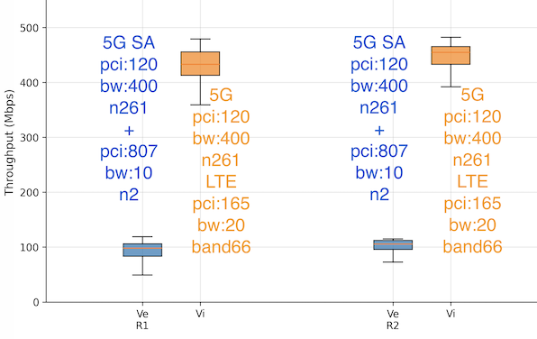
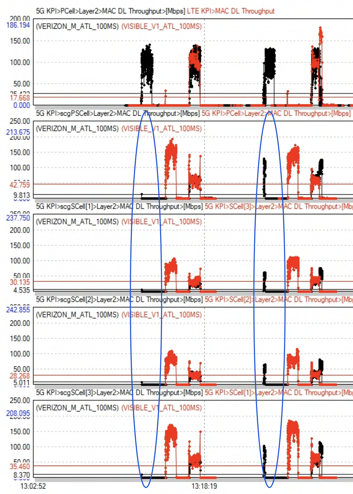
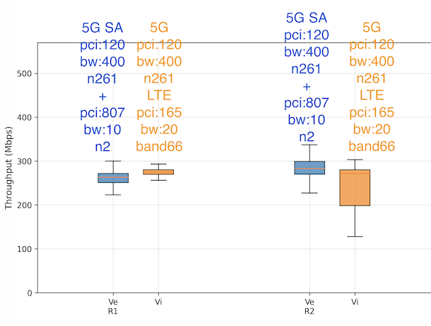
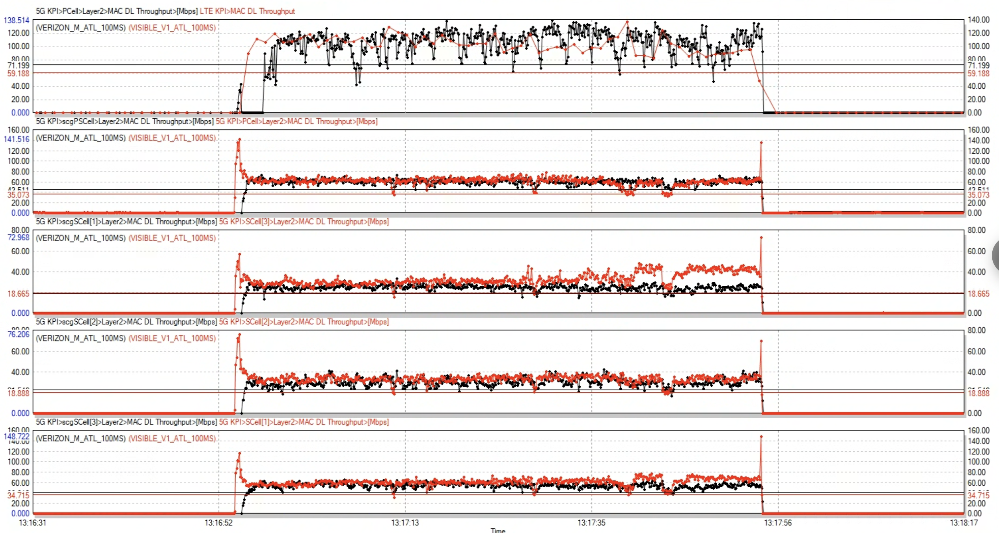
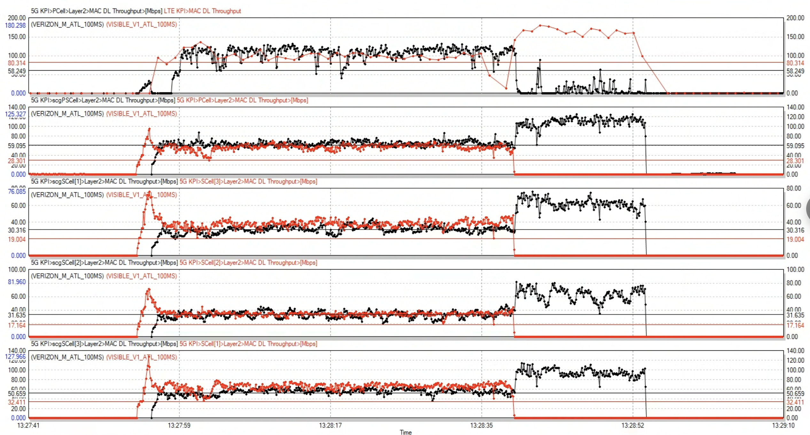
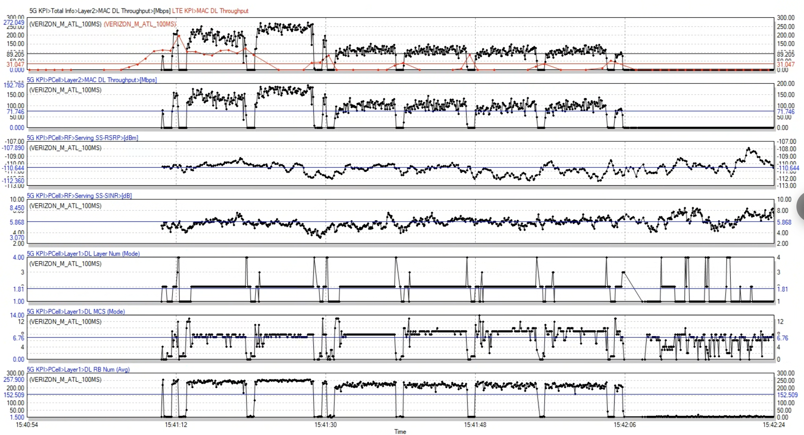
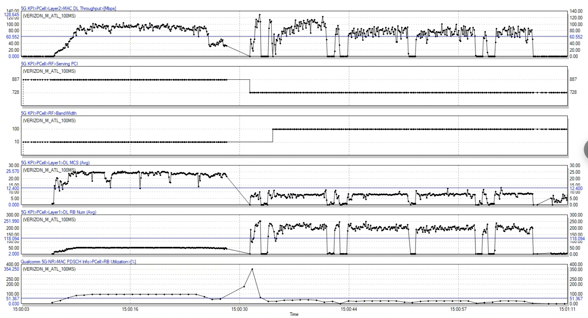
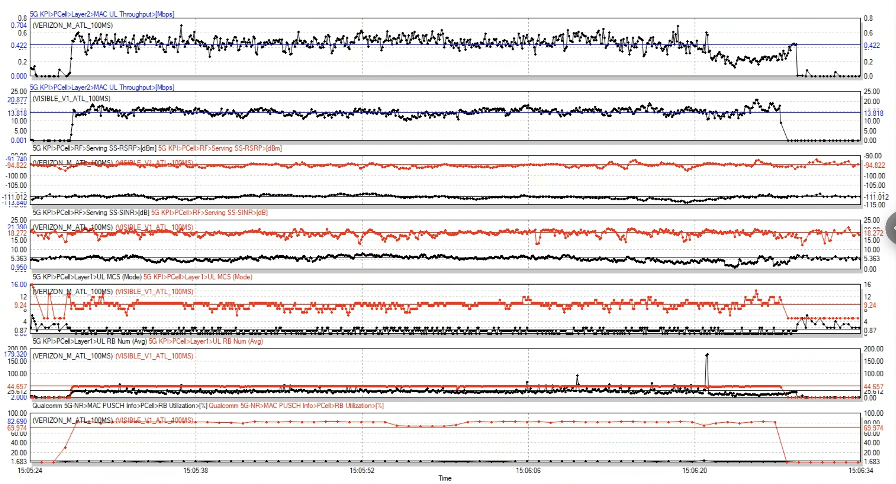
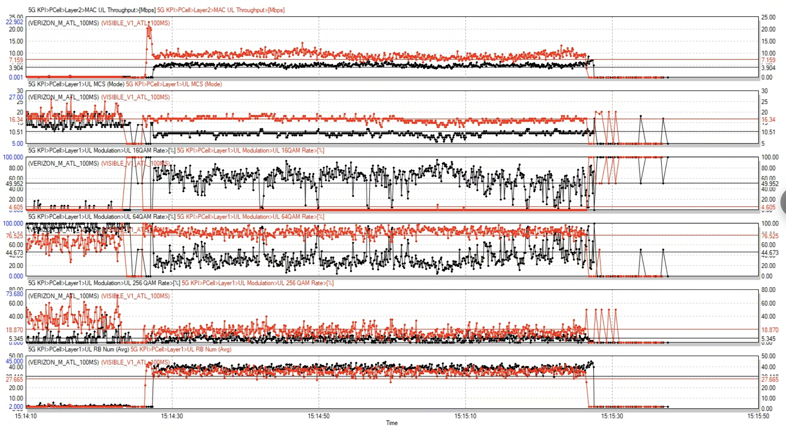

# Verizon (M) & Visible (V1) & Twigby (V2)
## Atlanta
### Location 4 DL
#### Run 1, isolated running

Verizon - mmWave dead

#### Run 1, simultaneously running

Two operators share mmWave well

### Location 5 DL
Special scheduling pattern when Verizon connected to PCI 728

Here was a handover event, the special pattern only shows in PCI 728

### Location 5 UL
#### Run 1, Verizon(pci 728, bw 100) vs Visible(pci 887, bw 10)
728 has worse channel than 887, which lead to fewer RBs

#### Run 3, Verizon(pci 887, bw 10) vs Visible(pci 887, bw 10)
Visible uses more aggressive scheduling algorithm, which causes higher MCS and higher QAM

